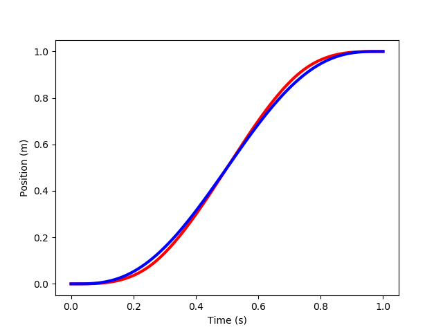
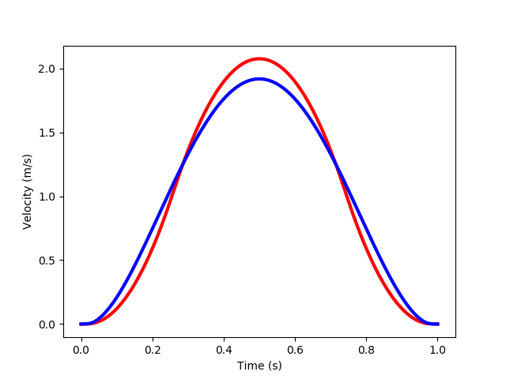

**mypy**: An Useful Toolbox for Control Engineers 
======

Overview
========

**mypy** is an useful toolbox for control engineers.
It can be used for a wide range of purposes: to identify a system transfer functions, to optimize a trajectory plan, ..., and so on.

Requirements
============

* Python 3.5+.
* *numpy*, *scipy*, and *sympy* (all included in **anaconda**)
* *mycvxopt* requires *cvxopt*.

Install
=======
Just append *mypy* to your *PYTHONPATH*, or

	import sys
	sys.path.append(r"/home/me/mypy")

Documentation
=============

Documentation is not available for now.

Examples
=============

* Optimized Multisine: better S/N-ratio excitation 

Optimized Multisine.

FFT of Optimized Multisine.

* System Identification: linear least squares, iterative weighted linear least squares, nonlinear least squares,  and maximum likelihood estimation solution. 

FRF.

System Identification Results.

* Trajectory Planning: B-spline trajectory of jerk 2/infinity-norm minimization with constraints (Red: infinity-norm minimization, Blue: 2-norm minimization)

* Feedback Controller Design: Exploiting FRF results, finding a linear FB controller that satisfies desired (given) linear constaraints for FB, i.e. (1) Gain-Crossover Constraint (G.C.), (2) Phase Margin Constraint (P.M.), (3) Gain Margin Constraint (G.M.), (4) Second Phase Margin Constraint (P.M.2), (5) Gain Minimum/Maximum Constraints, (6) Other Linear Equalities/Inequalities.
Default Controller: PIDs + 10 FIRs (13 variables).

Plant FRF.

Optimized Nyquist Plot.

Optimized Open-Loop FRF.

Copyright and License
=============

	2017-, Shimoda Takaki, The University of Tokyo

mypy is free software; you can redistribute it and/or modify it under the terms of the GNU General Public License as published by the Free Software Foundation; either version 3 of the License, or (at your option) any later version.

mypy is distributed in the hope that it will be useful, but WITHOUT ANY WARRANTY; without even the implied warranty of MERCHANTABILITY or FITNESS FOR A PARTICULAR PURPOSE. See the GNU General Public License for more details.

