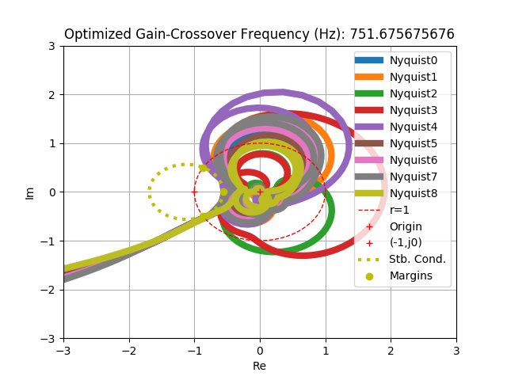
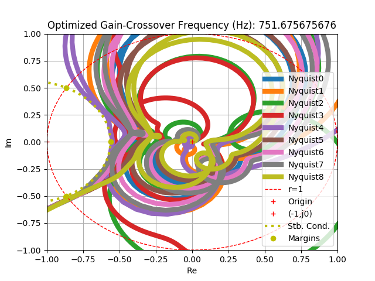

**mypy**: An Useful Toolbox for Control Engineers 
======

Overview
========

**mypy** is an useful toolbox for control engineers.
It can be used for a wide range of purposes: to identify a system transfer functions, to optimize a trajectory plan, to automatically design good FB controllers, ..., and so on.

Requirements
============

* Python 3.5+.
* *numpy*, *scipy*, and *sympy* (all included in **anaconda**)
* *mycvxopt* requires *cvxopt*.

Install
=======
Just append *mypy* to your *PYTHONPATH*, or

	import sys
	sys.path.append(r"/home/me/mypy")

Documentation
=============

Documentation is not available for now.

Examples
=============

* Optimized Multisine: better S/N-ratio excitation 

Optimized Multisine.

FFT of Optimized Multisine.

* System Identification: linear least squares, iterative weighted linear least squares, nonlinear least squares,  and maximum likelihood estimation solution. 

FRF.

System Identification Results.

* Trajectory Planning: B-spline trajectory of jerk 2/infinity-norm minimization with constraints (Red: infinity-norm minimization, Blue: 2-norm minimization)

* Feedback Controller Design: Exploiting FRF results, find a linear FB controller that satisfies desired (given) linear constraints for all plant perturbations,
    i.e. (1) Gain-Crossover Linear Inequalities,
         (2) Phase Margin Linear Inequalities,
         (3) Gain Margin Linear Inequalities,
         (4) Second Phase Margin Linear Inequalities,
         (5) Gain Minimum/Maximum Linear Inequalities,
         (6) Stability Margin (Disk) Concave Inequalities via CCCP method,
         (7) Robust Stability Quadratic Inequalities (using socp or sdp),
         (8) Nominal Performance (Disk) Concave Inequalities via CCCP method.
Default Controller: PIDs + 10 FIRs (13 variables).

Plant FRF.

Nyquist Plot of Optimized Open-Loop FRF.

Sensitivity.

Copyright and License
=============

	2017-, Shimoda Takaki, The University of Tokyo

mypy is free software; you can redistribute it and/or modify it under the terms of the GNU General Public License as published by the Free Software Foundation; either version 3 of the License, or (at your option) any later version.

mypy is distributed in the hope that it will be useful, but WITHOUT ANY WARRANTY; without even the implied warranty of MERCHANTABILITY or FITNESS FOR A PARTICULAR PURPOSE. See the GNU General Public License for more details.

